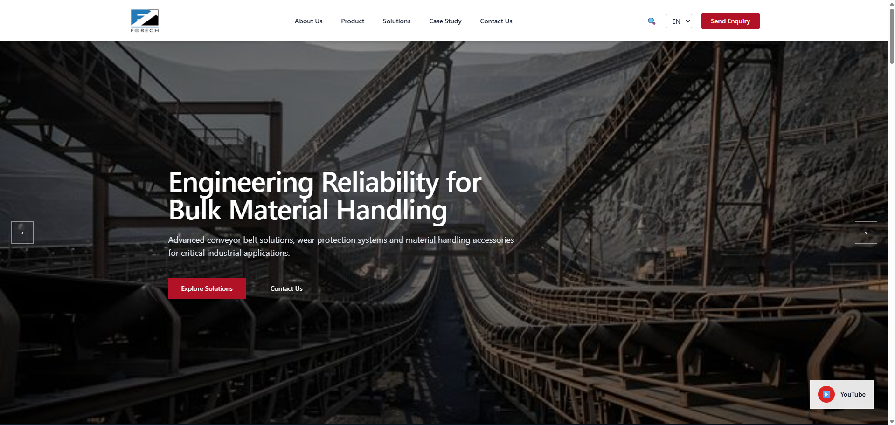
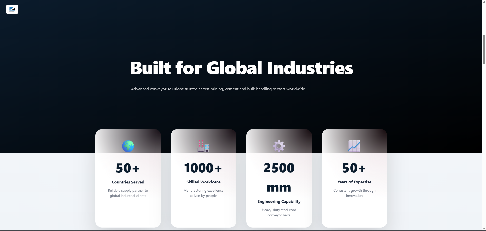
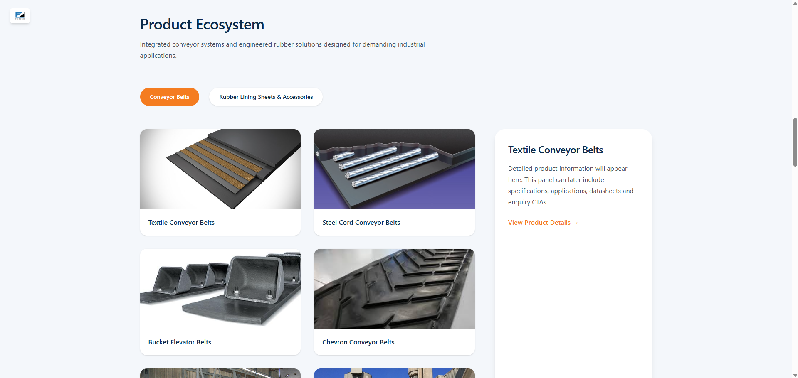
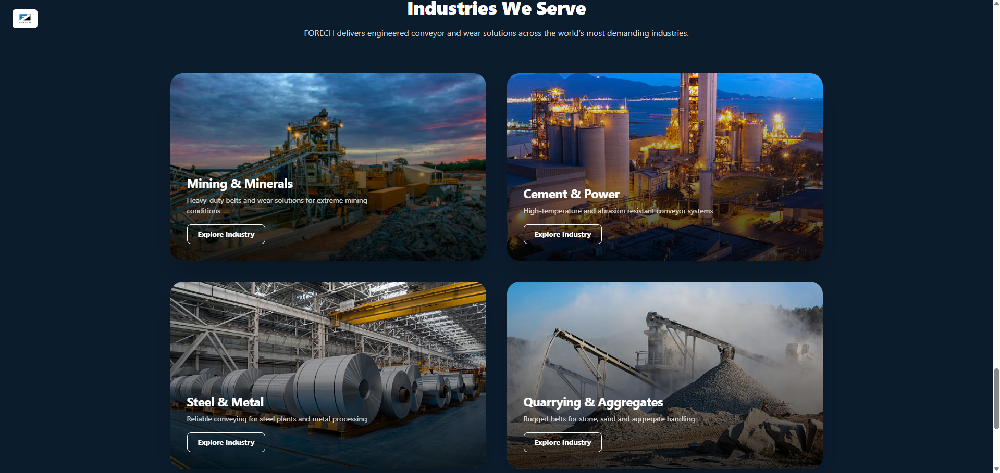
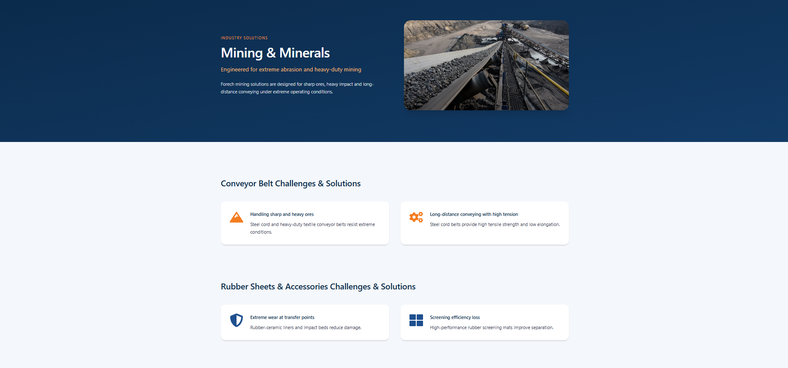

# 🏭 Industrial Company Website UI

A modern industrial company website UI inspired by real-world business websites. Built using React.js and Tailwind CSS with a focus on clean layout and reusable components.

---
## 🌐 Live Demo

[Click here to view the live website](https://hemun-ui.vercel.app/)

## 🚀 Features

- Responsive design
- Component-based architecture
- Industrial-style layout
- Clean UI sections
- Scalable structure

---

## 🛠️ Tech Stack

- React.js
- Tailwind CSS
- JavaScript
- HTML5 / CSS3

---

## 📁 Project Structure

src/
 ├── components/    # Reusable UI components
 ├── pages/         # Page sections
 ├── assets/        # Images/icons
 ├── App.jsx
 ├── main.jsx

---

## ⚙️ Run Locally

Clone the project

git clone https://github.com/vaid-hemun/industrial-website-design

Go to project directory

cd your-repo-name

Install dependencies

npm install

Start development server

npm run dev

---

## 📷 Screenshots

### Homepage

### InfographicsSection

### Products Section

### Industries Section

### Industries Inside Section

### Footer Section

---

## 📌 Project Status

🚧 Work in Progress – UI improvements and additional sections are being added.

---

## 👨‍💻 Author

Frontend practice project created as part of learning and portfolio development.
